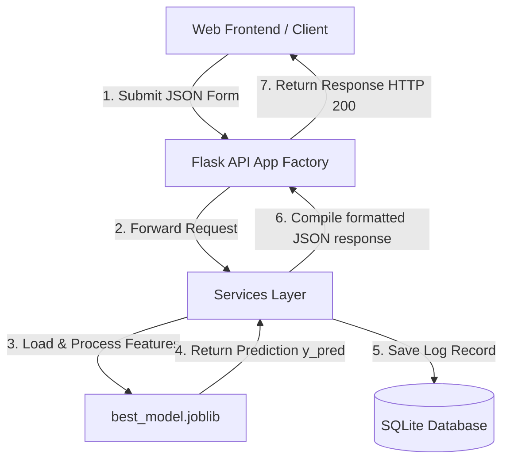

# CredAI - Credit Card Approval Prediction System

An end-to-end, professional, and secure Credit Card Approval Prediction System powered by advanced machine learning models and a responsive glassmorphic web dashboard.

---

## 1. Project Description
**CredAI** is a full-stack AI/ML application designed to predict whether credit card applications should be approved or declined. Built with a focus on **Explainable AI (XAI)** and strict regulatory compliance, it serves real-time inference predictions using only demographic and financial parameters available at the time of application.

---

## 2. Problem Statement
Manual credit evaluation processes are slow, susceptible to human bias, and expensive to execute at scale. Traditional automated credit checkers frequently operate as "black boxes" that deny card access without giving applicants transparent feedback. CredAI provides an instant, secure, and explainable alternative to improve banking efficiency and customer support.

---

## 3. Key Features
* **Leakage-Free Prediction Pipeline**: Redesigned to predict risk for completely new applicants without relying on historical payment logs.
* **Explainable AI Recommendations**: Decodes model decision boundaries and serves actionable improvement recommendations to rejected candidates.
* **Analytics Dashboard**: Dynamic metrics summaries (Total Predictions, Approval Rate, Rejection Rate, Avg Confidence) and interactive Chart.js charts.
* **Prediction History Log**: Audits past evaluations, parameters, and results with built-in search, pagination, filtering, and sorting controls.
* **Security & Input Validation**: Strict validation of data types, ranges, and cross-field boundary constraints, protecting backend databases from SQL injection.
* **Dockerized Deployment**: Clean container configurations ready to scale out of the box using Gunicorn.

---

## 4. Technologies Used
* **Machine Learning**: Python, Pandas, Scikit-learn, XGBoost, Joblib, Matplotlib, Seaborn
* **Backend Server**: Flask API, SQLAlchemy ORM, SQLite DB, Flask-CORS, Gunicorn WSGI
* **Frontend Web**: HTML5, Vanilla CSS, Vanilla JavaScript, FontAwesome Icons, Chart.js

---

## 5. Project Architecture & Data Flow



---

## 6. Folder Structure

```text
Credit_Card_Approval_System/
├── backend/                   # Flask REST API Backend
│   ├── __init__.py            # Exposes app factory
│   ├── app.py                 # App factory and middleware configurations
│   ├── config.py              # Centralized environment configurations
│   ├── models.py              # SQLAlchemy database model mappings
│   ├── routes.py              # API Blueprints endpoints
│   ├── services.py            # Preprocessing and prediction services
│   └── utils.py               # Safe readers, logging, and helpers
├── config/
│   └── settings.py            # Global ML pipeline parameter parameters
├── data/                      # Data files folder
│   ├── application_record.csv # Demographic application data
│   └── credit_record.csv      # Monthly credit history data
├── deploy/                    # Container configurations
│   ├── Dockerfile             # Production runtime container
│   └── docker-compose.yml     # Services docker orchestration
├── docs/                      # Technical project documentation
│   ├── api_docs.md            # REST API endpoint details
│   ├── deployment_guide.md    # Local and container deployment instructions
│   └── model_explanation.md   # ML pipeline algorithms and features details
├── frontend/                  # Web Interface Files
│   ├── static/                # Static assets folder
│   │   ├── css/
│   │   │   └── style.css      # Responsive glassmorphic layout styles
│   │   └── js/
│   │       ├── main.js        # Global highlighting and toast notifications
│   │       └── charts.js      # Dashboard charts and history tables handlers
│   └── templates/
│       ├── base.html          # Master layouts template
│       ├── index.html         # Landing Home page
│       ├── predict.html       # Credit card wizard application form
│       ├── dashboard.html     # Charts metrics analytics
│       ├── history.html       # Auditing history log tables
│       ├── about.html         # Project details page
│       └── contact.html       # Feedback contact forms
├── models/                    # Serialized pipeline weights binaries
│   ├── candidates/            # Grid-tuned models binaries
│   ├── best_model.joblib      # Production champion classifier
│   └── preprocessor.joblib    # Columns transformer weights
├── reports/                   # Performance output metrics and CSV lists
├── tests/                     # Automated unit and integration testing suite
│   ├── test_backend.py        # API routing simulation tests
│   └── test_ml.py             # ML pipeline checks
├── .env                       # Environment configs
├── requirements.txt           # Python library requirements list
└── run.py                     # Project main runner entrypoint script
```

---

## 7. Machine Learning Pipeline Redesign (Anti-Leakage Mitigation)
The system has been updated to remove target leakage:
1. **Target Generation**: The monthly log table (`credit_record.csv`) is used **strictly offline** to generate a one-time binary target `APPROVED`.
2. **Feature Discarding**: Repayment history metrics (e.g. `LATE_PAYMENTS_COUNT`, `REPAYMENT_CONSISTENCY`, and `CREDIT_HISTORY_LENGTH`) are **completely discarded** and are never fed to the ML model.
3. **Serving Compatibility**: A new applicant can submit their information and get an instant risk assessment without having any monthly payment logs on this card.

---

## 8. Installation & Running Guide

Detailed step-by-step instructions for running the application can be found in the [Deployment Guide](file:///c:/Users/SAIKUMAR/OneDrive/Desktop/Credit_Card_Approval_System/docs/deployment_guide.md).

### Quick Start
1. **Install Dependencies**:
   ```bash
   pip install -r requirements.txt
   ```
2. **Execute ML Pipeline**:
   ```bash
   python ml_pipeline/data_preprocessing.py
   python ml_pipeline/train.py
   python ml_pipeline/evaluate.py
   ```
3. **Start local Server**:
   ```bash
   python run.py
   ```
4. **Deploy with Docker Compose**:
   ```bash
   docker compose -f deploy/docker-compose.yml up -d --build
   ```

---

## 9. API Endpoints List

Detailed request payloads, formatting parameters, and error wrappers are documented in the [API Documentation](file:///c:/Users/SAIKUMAR/OneDrive/Desktop/Credit_Card_Approval_System/docs/api_docs.md).

| Endpoint | Method | Description |
| :--- | :--- | :--- |
| `GET /` | `GET` | Returns root index landing layout. |
| `GET /api/health` | `GET` | Verifies Flask server and ML models assets load status. |
| `POST /api/predict` | `POST` | Processes JSON payload and returns approvals classification status. |
| `GET /api/history` | `GET` | Retrieves paginated and filtered historical logs. |
| `DELETE /api/history/<id>` | `DELETE` | Deletes specific history record log. |

---

## 10. Model Evaluation Summary (Post-Redesign)
The active model is a **Support Vector Machine (SVM)** classifier:

| Algorithm | Accuracy | Precision | Recall | F1-Score | ROC-AUC | CV-Score |
| :--- | :--- | :--- | :--- | :--- | :--- | :--- |
| **SVM** | 0.5906 | 0.5906 | 1.0000 | 0.7426 | 0.4713 | 0.5901 |
| **Logistic Regression** | 0.5906 | 0.5920 | 0.9867 | 0.7400 | 0.5579 | 0.5861 |
| **XGBoost** | 0.5827 | 0.5948 | 0.9200 | 0.7225 | 0.5500 | 0.5921 |
| **Gradient Boosting** | 0.5512 | 0.5789 | 0.8800 | 0.6984 | 0.5523 | 0.6000 |

---

## 11. License & Contributing
* **Contributing**: Pull requests are welcome. For major changes, please open an issue first to discuss what you would like to change.
* **License**: MIT License.
